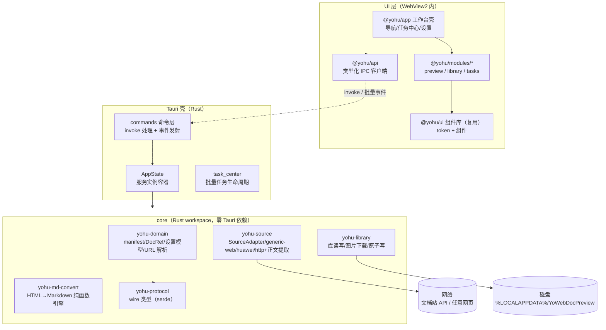

# YoWebDocPreview — 架构设计 v1

> **状态：** 设计定稿（待实现）  
> **日期：** 2026-08-27  
> **配套文档：** `docs/requirements/需求分析.md`（v1 版）  
> **参考架构：** `Yovo-Windows-ADBTools-tauri`（`docs/architecture/架构设计-v6.md`）——继承其分层模型、core 零 Tauri 依赖、批量 IPC、原子写等 ADR 精神；本项目为全新代码库。

---

## 0. 一句话结论

**Rust 领域核心 + Tauri 2 桌面壳 + SolidJS UI** 的模块化单体：HTTP 抓取、正文提取、HTML→Markdown 转换、文档库读写全部下沉到零 Tauri 依赖的 Rust workspace（可独立测试）；UI 提供在线预览（HTML/Markdown 双视图）、本地文档库浏览与批量任务管理；高频进度走**批量 IPC 事件**；安装包目标 **≤ 15 MB**，不捆绑任何语言运行时。

---

## 1. 设计目标与非目标

### 1.1 目标

| # | 目标 | 成功标准 |
|---|------|----------|
| G1 | 轻量化 | 安装包 ≤ 15 MB；复用系统 WebView2；无 Python/Node 运行时 |
| G2 | 转换保真度 | ≥ 50 篇黄金样本 diff 与 Python 输出语义一致 |
| G3 | 通用性 | generic-web 兜底任意 URL；SourceAdapter trait 扩展结构化站点零改核心 |
| G4 | 批量效率 | 1000 篇并发 4 < 10min；进度实时、可取消、断点续跑 |
| G5 | 中文体验 | 全中文 UI；WebView2 原生 IME |

### 1.2 非目标（本期不做）

- 跨平台（macOS/Linux）：架构不排斥，本期只交付 Windows
- 登录态/Cookie 鉴权抓取（D5）
- Playwright/无头浏览器渲染（JS 动态页面以「提示降级」处理，见 §5.3）
- 全站爬虫/站点发现：只抓用户显式给出的 URL 或清单
- 插件热加载：适配器静态注册
- Markdown 编辑器：本项目只读 + 导出，不做编辑

---

## 2. 架构总览

### 2.1 进程与层模型



### 2.2 依赖方向（唯一规则）

```text
UI（TS）   → @yohu/api → IPC ← commands（Rust）
                    ↑ 所有跨语言通信只经此一层
core crates：{ yohu-source, yohu-md-convert, yohu-library } → yohu-domain → yohu-protocol
app/commands → core crates（app 是唯一允许引用 Tauri 的地方）
禁止：core 引用 Tauri；模块间互相 import；跨层绕过 IPC（保存对话框经 @yohu/api dialog*）
组件库：复用 @yohu/ui（ADBTools 同源组件库）；应用身份（图标/名称/标识）独立，不套用 ADBTools 资产
```

### 2.3 核心设计原则

1. **core 零 Tauri 依赖**：转换引擎是纯函数 crate，`cargo test` 独立验证；未来可拆 CLI/服务化。
2. **转换在 core，渲染在 UI**：HTML→Markdown 只在 Rust 侧发生一次；预览的 HTML 视图直接用净化后原始 HTML，Markdown 视图渲染转换产物——两条视图共享同一次拉取结果。
3. **适配器即策略**：URL 解析、拉取方式、转换规则配置都封装在 SourceAdapter 后面；core 编排器对站点无感知。
4. **批量 IPC**：批量任务进度 200ms 聚合推送（继承 ADR-v6-007 精神），禁逐条刷。
5. **写盘即快照**：MD/manifest/设置一律原子写（临时文件 + rename），损坏备份 `.corrupt-<ts>`。

---

## 3. 工程结构

### 3.1 仓库布局

```text
Windows-YoWebDocPreview/
├── Cargo.toml                    # workspace（core/* + app/*）
├── rust-toolchain.toml           # 锁定 stable 版本
├── core/
│   ├── yohu-protocol/            # wire 类型：命令参数/返回/事件（serde，无 IO）+ 身份常量
│   ├── yohu-domain/              # 领域：DocRef/manifest 模型/URL→DocRef 解析/设置键表/时间归一化
│   ├── yohu-source/              # 文档源：http 客户端/正文提取/SourceAdapter trait/generic-web/huawei
│   ├── yohu-md-convert/          # HTML→Markdown 转换引擎（纯函数，零 IO）
│   └── yohu-library/             # 文档库：manifest 读写/MD 写盘/图片下载映射/原子写
├── app/
│   └── yohu-app/                 # Tauri 壳：main/lib、commands(薄)、state、task_center
├── ui/
│   ├── pnpm-workspace.yaml
│   ├── packages/
│   │   ├── api/                  # @yohu/api：类型化 invoke 封装 + 事件订阅
│   │   ├── ui/                   # @yohu/ui：复用 ADBTools 组件库（pnpm file:/git 依赖引入；不复制其 app icon/身份资产）
│   │   ├── app/                  # @yohu/app：工作台壳 + 模块注册表
│   │   └── modules/
│   │       ├── preview/          # @yohu/module-preview：在线预览（双视图）
│   │       ├── library/          # @yohu/module-library：本地文档库
│   │       └── tasks/            # @yohu/module-tasks：批量任务中心
│   └── apps/
│       └── shell/                # Vite 入口，Tauri frontendDist 指向此处
├── testdata/
│   ├── golden/                   # 黄金样本：输入 HTML + 期望 MD（≥50 篇）
│   └── fixtures/                 # 录制的 API 响应 JSON（适配器测试）
├── scripts/
│   ├── verify-smoke.ps1          # 冒烟回归
│   └── import-golden.py          # 从 yohu-harmonyos-docs 导出黄金样本（一次性工具）
├── docs/
│   ├── requirements/需求分析.md
│   └── architecture/架构设计-v1.md
└── tauri.conf.json
```

### 3.2 Crate 依赖图

```text
yohu-protocol ← yohu-domain ← { yohu-source, yohu-md-convert, yohu-library } ← yohu-app
     ↑                                                            ↑
 (serde wire 类型，全图最底层)                        (唯一引用 tauri)

注：yohu-md-convert 不依赖 domain（纯函数，输入输出皆 String/结构体）；
    yohu-source 与 yohu-library 平级，由壳层编排组合。
```

### 3.3 前端包依赖图

```text
apps/shell → @yohu/app + @yohu/modules/*（唯一组合点：registerModule(descriptor)）
@yohu/modules/* → @yohu/api + @yohu/ui（禁止依赖 @yohu/app、禁止模块互引）
@yohu/app → @yohu/api + @yohu/ui（不依赖 modules；设置页为壳内建）
```

---

## 4. Rust 核心（core/）

### 4.1 yohu-protocol（wire 类型）

纯数据结构（serde），无 IO。含身份常量（`PRODUCT_NAME="YoWebDocPreview"` / `IDENTIFIER="com.yohu.webdocpreview"` / `DATA_DIR_NAME`）与事件名常量（`/` 分层）。

```rust
// 核心类型（示意）
pub struct DocRef { pub source_id: String,      // "huawei-harmonyos" | "generic-web"
                    pub catalog: Option<String>, // 结构化源才有
                    pub slug: String, pub url: String }

pub struct RawDoc { pub title: String, pub update_time: Option<String>,
                    pub html: String, pub device_types: Vec<String> }

pub struct DocMeta { pub doc_ref: DocRef, pub title: String,
                     pub update_time: Option<String>, pub source_url: String,
                     pub channel: FetchChannel }   // Adapter | GenericWeb

pub struct TaskProgress { pub run_id: u32, pub done: u32, pub total: u32,
                          pub failed: u32, pub state: TaskState,
                          pub current: Option<String>,   // 当前处理的 URL/标题
                          pub errors: Vec<TaskError> }   // 失败明细（截断至最近 N 条）

pub struct LibraryEntry { pub file: String, pub url: String, pub slug: String,
                          pub catalog: String, pub local_time: Option<String>,
                          pub official_time: Option<String>, pub status: String }
```

### 4.2 yohu-domain（纯领域，无 IO）

| 模块 | 内容 |
|------|------|
| `doc_ref.rs` | `parse_url(url)` → `DocRef`：先逐个尝试注册的专用适配器 URL 模式（华为 `/consumer/cn/doc/<catalog>/<slug>`），未命中回退 `generic-web`；slug 合法性校验 |
| `manifest.rs` | manifest 条目模型 + serde 读写模型（兼容现有知识库字段：`file/url/slug/catalog/local_time/official_time/status`）；schemaVersion 校验 |
| `time_cmp.rs` | 更新时间归一化（取前 19 字符）与对比逻辑（移植 `check_updates.py::normalize_time`） |
| `settings.rs` | 设置键枚举与默认值表（需求 §4.8） |
| `naming.rs` | 导出文件名/目录名派生（标题 → 安全文件名；assets 子目录 = 文档名） |

### 4.3 yohu-source（文档源层）

| 模块 | 职责 |
|------|------|
| `http.rs` | 共享 reqwest 客户端：UA/Accept-Language/Sec-Fetch 默认头（移植脚本 header 表）、超时（`request_timeout_sec`）、并发信号量（`concurrency`） |
| `extract.rs` | **通用正文提取**（generic-web 用）：Readability 式启发算法——DOM 候选块评分（文本密度/链接密度/标签权重 `<article>/<main>`）→ 取主内容容器 → 净化（剥离 script/style/nav/footer/aside/ad 类）。实现选型：`readability` crate 或自研简化版（见 ADR-W1） |
| `adapter.rs` | `SourceAdapter` trait 定义 + 注册表（静态注册，按 `match_url` 优先级匹配） |
| `huawei.rs` | 华为适配器：`POST getDocumentById`（payload `{objectId, version, catalogName, language:"cn"}`）；响应解析 `value`/`data` 双兼容；device-type 映射 Phone/PC·2in1/Tablet/Wearable/TV；六 catalog 最长匹配优先（同 `catalog_for_manifest`） |
| `generic.rs` | 通用网页适配器：GET 页面 → `extract::readability` → `RawDoc { title=<title>/h1, update_time=None }` |

```rust
#[async_trait]
pub trait SourceAdapter: Send + Sync {
    fn id(&self) -> &'static str;
    fn match_url(&self, url: &str) -> Option<DocRef>;
    async fn fetch(&self, http: &HttpClient, r: &DocRef) -> Result<RawDoc, SourceError>;
}
```

**编排入口** `source::fetch_any(registry, http, url)`：match 专用适配器 → 命中则走适配器并标记 `channel=Adapter`；否则 generic-web 兜底标记 `channel=GenericWeb`。UI 经 `doc.meta` 展示当前通道。

### 4.4 yohu-md-convert（转换引擎，纯函数）

全量移植 `fetch_docs.py::html_to_markdown` 的 14 步规则（需求 §4.3 清单），签名：

```rust
pub struct ConvertOptions {
    pub title: String,
    pub update_time: Option<String>,
    pub source_url: String,
    pub catalog: Option<String>,          // harmonyos-references 有元数据间距特例
    pub image_map: HashMap<String, String>, // 远程 URL → 本地相对路径
    pub base_url: Option<Url>,             // 相对链接补全（generic-web 必填）
}

pub fn html_to_markdown(html: &str, opts: &ConvertOptions) -> String;
```

内部结构（对应 Python 步骤编号，便于对照验收）：

| 模块 | 对应 Python 步骤 |
|------|------------------|
| `protect.rs` | 代码块占位保护/还原（步骤 1、10、13 的二次保护）、表格内 note 提取与占位还原（步骤 0） |
| `headings.rs` | h1–h4 映射、`[h2]` 标记剔除、device-type 行（步骤 4） |
| `tables.rs` | rowspan 展开、`\|` 转义、th 分隔行（步骤 5） |
| `inline.rs` | strong/b/a/span/p/br（步骤 6、8、9） |
| `lists.rs` | ol 自动编号/ul/li 多段折叠（步骤 7） |
| `notes.rs` | note → callout 分类（NOTE/WARNING/TIP）（步骤 11） |
| `images.rs` | img 标签 → 本地路径/远程 URL（步骤 12） |
| `postprocess.rs` | 尖括号转义/`$r` 转义/图片独立成行/前导空格/API 元数据间距（后处理，全程保护代码块） |
| `header.rs` | 文档头生成（步骤 12 输出组装） |

**关键纪律**：所有正则行为与 Python 版逐条对齐；每步一个单测模块；黄金样本集成测试兜底（§10）。

### 4.5 yohu-library（文档库层）

| 组件 | 职责 |
|------|------|
| `store.rs` | 库根目录管理：`library_root` 解析、目录创建、manifest 加载/保存（原子写 + schema 失配备份重建） |
| `writer.rs` | 单篇落盘：MD 写入（原子写）+ manifest 条目 upsert；文件名冲突策略 = 覆盖（同 URL）或追加序号（不同 URL 同名，用户可选，默认覆盖同 URL） |
| `images.rs` | 图片资源管理：① 扫描 `assets/<doc-name>/` 已有资源按出现顺序对齐映射（移植 `build_image_map`）；② 缺失的下载（png/jpg/jpeg/gif/svg，Content-Type 校验，失败保留远程 URL 并记录告警） |
| `import.rs` | 外部清单导入：解析 `docs_to_update.json` 格式 → 任务条目列表 |
| `check.rs` | 更新检查执行器：遍历 manifest → 读本地 MD 头部 `更新时间：` → 经 source 层查官方时间 → 归一化对比 → 产出 NEW/UPDATE 清单；进度持久化 `.check_progress.json`（断点续跑） |
| `batch.rs` | 批量抓取执行器：任务队列 + 并发 worker（`concurrency` 信号量）+ CancellationToken + 进度事件回调 + 断点续跑（已完成条目跳过） |

### 4.6 异步与取消模型

- tokio multithread runtime；Tauri 命令处理器与 core 服务共享 runtime。
- 取消统一 `tokio_util::sync::CancellationToken`：应用根 token → 每个 batch run 一个子 token；退出序列 = 根 cancel → 任务收敛（进行中的 HTTP 请求中断，已完成的条目状态已持久化）→ flush 设置。
- 错误模型：统一 `YohuError`（`Network` / `Api { code, message }` / `NotFound` / `ExtractFailed` / `Io` / `Cancelled` / `Invalid`），IPC 层映射 `{ code, message }`，前端按 code 处理。

---

## 5. 关键技术方案

### 5.1 HTML→Markdown 保真度策略

- **黄金样本驱动**：`scripts/import-golden.py` 从 yohu-harmonyos-docs 抽取 ≥50 篇（覆盖 guides/references/faqs/best-practices/design/releases 六 catalog + 含表格/代码/callout/图片的典型篇目），产出 `testdata/golden/<n>/{input.html, expected.md}`。
- **集成测试**：`cargo test -p yohu-md-convert --test golden` 逐样本跑 `html_to_markdown`，与 expected.md 做**规范化 diff**（行尾空白/连续空行折叠后比较）；差异必须为零或显式豁免（记录在 `testdata/golden/exceptions.md`）。
- **通用网页通道不做黄金样本**（无参照物），以单测覆盖典型 HTML 结构（article/main/多级标题/表格/代码块）。

### 5.2 正文提取（generic-web）方案对比

| 方案 | 结论 |
|------|------|
| `readability` crate（Mozilla Readability 移植） | **首选（ADR-W1）**：成熟、启发式完整；体积可控 |
| 自研简化评分器 | 备选：若 crate 依赖树超预算（安装包 ≤15MB）或维护停滞则切换；接口收敛在 `extract.rs` 内，切换不影响上层 |
| 无头浏览器渲染 | 否决：违背轻量与非目标约束；JS 渲染页面降级为「提取失败」明确错误态 |

### 5.3 图片双策略（D4）

```text
导出单篇：
  assets_dir = <md 所在目录>/assets/<doc-name>/
  ① build_image_map：扫描已有资源（排序后按 img 出现顺序对齐）→ 映射复用
  ② 未映射的远程图片 → 并发下载（受 concurrency 限制）→ 写入 assets_dir → 补充映射
  ③ 下载失败 → 保留远程 URL + 告警条目进任务错误明细
```

### 5.4 断点续跑

- 更新检查：`.check_progress.json` 记录 `processed[]`（`catalog::slug` 键集）+ `total_checked`，每 100 条持久化一次（同脚本节奏）。
- 批量抓取：run 目录 `%LOCALAPPDATA%\YoWebDocPreview\runs\<run_id>\state.json` 记录已完成条目；重跑同清单自动跳过；run 完成后清理 state。

---

## 6. Tauri 壳（app/yohu-app）

| 模块 | 职责 |
|------|------|
| `lib.rs` | 组装 AppState（HttpClient/适配器注册表/LibraryStore/CancellationToken 树） |
| `commands/*.rs` | **薄命令层**：参数反序列化 → core API → 结果序列化；禁止业务逻辑 |
| `task_center.rs` | 批量任务生命周期：发号 run_id、spawn batch/check 执行器、进度聚合转发（200ms 节流）、取消分发 |
| `state.rs` | `AppState`：服务容器 + AppHandle（事件发射） |
| `paths.rs` | LocalAppData 路径目录（身份常量驱动；`library_root` 重启冻结快照） |
| `panic.rs` | panic hook 写 `logs/panic-<ts>.log` |

### 6.1 tauri.conf.json 要点

```jsonc
{
  "build": { "frontendDist": "../ui/apps/shell/dist" },
  "bundle": {
    "targets": ["nsis"],
    "windows": {
      "webviewInstallMode": { "type": "embedBootstrapper" },
      "nsis": { "installMode": "perUser", "languages": ["SimpChinese"] }
    }
  },
  "app": {
    "security": {
      "csp": "default-src 'self'; style-src 'self' 'unsafe-inline'; img-src 'self' https: data:",
      "capabilities": "default"
    }
  }
}
```

> CSP 注意：预览 HTML 视图含远程图片（未下载场景），故 `img-src` 放开 `https:`；其余源收紧。预览 HTML 以 sandbox iframe 或 DOMPurify 净化后注入（ADR-W2：采用 **DOMPurify 净化 + 受限样式注入**，不用 iframe，保证主题一致与缩放控制）。

---

## 7. UI 层（ui/）

### 7.1 技术选型

| 项 | 选择 | 理由 |
|----|------|------|
| 框架 | SolidJS | 细粒度响应式；与参考架构同栈，组件经验可复用 |
| 构建 | Vite + pnpm monorepo | 标准组合 |
| 语言 | TypeScript strict | 与 @yohu/api 类型对齐 |
| Markdown 渲染 | markdown-it + highlight.js（按需语言） | 成熟轻量；GFM 表格/删除线支持 |
| HTML 净化 | dompurify | 预览原始 HTML 防注入 |

### 7.2 组件层（复用 @yohu/ui）

**直接复用 ADBTools 的 `@yohu/ui` 组件库**（pnpm workspace 外部依赖引入，git 依赖或本地 path 依赖），获得现成的 token 体系（三层 token + 双主题 + 密度）、Yo* 组件与 lint 纪律。**应用身份资产独立**：本项目使用自己的 app icon、窗口标题、产品名与包标识，**不套用 ADBTools 的图标与身份常量**（身份常量单源仍在 `yohu-protocol`，取值见 §6.2）。

v1 需要的组件（@yohu/ui 已有大部分，缺项按需补充进该组件库，保持单源）：

| 类别 | 组件 |
|------|------|
| 基础 | YoButton、YoIconButton、YoTextField、YoSelect、YoCheckbox、YoBadge、YoProgressBar |
| 布局 | YoPage、YoToolbar、YoPanel、YoStatusBar |
| 数据 | YoTree（文档库目录树）、YoList（虚拟化清单，更新结果/历史记录） |
| 复合 | YoTabs（预览双视图切换）、YoDialog、YoToast/YoToaster、YoEmptyState、YoLoading |
| 专属 | **YoDocPreview**（HTML 净化渲染 + Markdown 渲染双模式容器，本项目新增）、YoMetaBar（标题/时间/来源/通道徽章，本项目新增） |

### 7.3 模块划分

| 模块 | id | 职责 |
|------|----|------|
| 在线预览 | `preview` | URL 输入栏（含历史下拉）/ 拉取按钮 / YoMetaBar / YoTabs（网页视图 \| Markdown 视图）/ 「导出 Markdown」「存入库」操作 |
| 本地文档库 | `library` | 库根目录展示 / YoTree 目录导航 / 文档阅读（复用 YoDocPreview Markdown 模式）/ manifest 列表（时间/状态列）/ 导入外部清单入口 |
| 任务中心 | `tasks` | 运行中任务卡片（进度/速率/ETA/当前条目）/ 更新检查结果清单（勾选批量执行）/ 失败明细 / 取消按钮 |

### 7.4 关键数据流（在线预览）

```text
UI preview.fetch(url)
  → IPC doc.fetch → core source::fetch_any（适配器优先/generic 兜底）
  → RawDoc 缓存于 AppState（最近 N=20 篇 LRU）
  → 返回 DocMeta + html
UI 双视图：
  网页视图 = DOMPurify(html) 注入 YoDocPreview
  Markdown 视图 = IPC doc.convert（RawDoc + 空 image_map）→ md 文本 → markdown-it 渲染
导出：
  IPC library.exportOne({ url, saveAs? })
  → core：fetch（或命中缓存）→ images（复用+下载）→ convert → 原子写 → manifest upsert
  → 返回落盘路径 → toast + system.openPath 可选
```

---

## 8. IPC 协议设计

### 8.1 invoke 命令表

| 命令 | 参数 | 返回 | 说明 |
|------|------|------|------|
| `doc.fetch` | `{ url }` | `DocMeta` | 拉取（命中缓存秒回）；正文经 `doc.html` 单独取（大 payload 分离） |
| `doc.html` | `{ url }` | `{ html }` | 取缓存的原始 HTML（配合 doc.fetch 两段式加载） |
| `doc.convert` | `{ url }` | `{ markdown }` | 缓存 RawDoc → 转换（不含图片本地化，预览用） |
| `doc.history` | — | `DocMeta[]` | 最近拉取历史（LRU 快照） |
| `library.root` | — | `{ root, entryCount }` | 当前库信息 |
| `library.tree` | — | `TreeNode[]` | 库目录树（md 文件聚合） |
| `library.read` | `{ file }` | `{ markdown, meta? }` | 读本地 MD（含头部元信息解析） |
| `library.manifest` | — | `LibraryEntry[]` | 全量 manifest 条目 |
| `library.exportOne` | `{ url, saveAs? }` | `{ path }` | 单篇导出（saveAs=true 弹保存对话框） |
| `library.importList` | `{ path }` | `{ count }` | 导入外部 docs_to_update.json → 待办清单 |
| `check.start` | `{ limit? }` | `runId` | 启动更新检查（后台任务） |
| `check.resume` | — | `runId` | 断点续跑 |
| `batch.run` | `{ entries[] }` | `runId` | 批量抓取（来自更新清单/导入清单/手动多选） |
| `task.cancel` | `{ runId }` | — | 取消任务 |
| `task.list` | — | `TaskProgress[]` | 任务快照 |
| `settings.get` / `settings.set` | `{ key }` / `{ key, value }` | value / 全量快照 | `settings/changed` 事件 |
| `system.info` | — | `{ identity, paths, settings }` | 关于/诊断 |
| `system.openPath` | `{ path }` | — | 打开导出文件/库目录 |
| `dialog.pickFolder` / `dialog.saveFile` | — | path? | tauri-plugin-dialog 封装（模块禁直连插件） |

### 8.2 事件表（core → UI）

> 事件名 `/` 分层（Tauri 2.9+ 禁点号）；常量单源 `yohu-protocol::event_names` ↔ `@yohu/api EVENT_NAMES`。

| 事件 | 载荷 | 频率/节流 |
|------|------|-----------|
| `task/progress` | `TaskProgress` | **200ms 聚合**（可丢，最新快照语义） |
| `task/done` | `{ runId, summary }` | 终态必达 |
| `task/error` | `{ runId, error }` | 逐条失败明细（批量上限 200 条，超出聚合计数） |
| `settings/changed` | `{ key, settings }` | 变更即发（必达，携带全量快照） |

### 8.3 背压与一致性

- `task/progress` 采用「最新快照」语义：UI 只关心 done/total 最新值，旧快照可丢（有界 mpsc + try_send，满则覆盖计数）。
- `task/done`、`settings/changed` 控制面事件 `send().await` 必达。
- 断点续跑状态在磁盘，事件丢失不影响一致性（重连后 `task.list` 对账）。

---

## 9. 数据与存储

### 9.1 路径规划（LocalAppData，无管理员权限）

```text
%LOCALAPPDATA%\YoWebDocPreview\
├── settings\settings.json        # 设置根固定
├── logs\                         # panic-*.log
├── runs\<run_id>\state.json      # 批量任务断点状态
├── cache\history.json            # 预览历史（LRU 持久化）
└── library\                      # 默认文档库根（library_root 可改，重启生效）
    ├── manifest.json
    ├── 开发/指南/xxx.md           # 用户自选目录结构
    └── assets\<doc-name>\*.png   # 图片资源
```

### 9.2 manifest schema（兼容现有知识库格式）

```jsonc
[
  {
    "file": "开发/指南/入门/xxx.md",
    "url": "https://developer.huawei.com/consumer/cn/doc/harmonyos-guides/xxx",
    "slug": "xxx",
    "catalog": "harmonyos-guides",
    "local_time": "2026-04-30 02:41:24",   // generic-web 条目为 null
    "official_time": "2026-05-26 06:48:54",
    "status": "UPDATE"
  }
]
```

- 原子写 + 损坏备份 `.corrupt-<ts>` 后重建空库（不猜测恢复）。
- generic-web 条目：`catalog="web"`、`slug=域名+路径哈希`、时间为 null。

### 9.3 设置存储

`settings.json`：schemaVersion + 原子写；键表见需求 §4.8；生效语义按键表（立即/重启/下次任务）。

---

## 10. 测试策略

| 层 | 工具 | 覆盖 |
|----|------|------|
| 转换引擎单元 | cargo test | 每个转换步骤独立用例（对照 Python 行为手写样例） |
| **黄金样本集成** | cargo test | ≥50 篇 input.html → 规范化 diff expected.md，零内容差异 |
| 适配器 | cargo test + fixtures | 录制响应 JSON 回放：华为六 catalog 解析/value-data 双兼容/404/超时 |
| 正文提取 | cargo test | 典型页面结构（article/main/噪声页）提取正确性 |
| 领域 | cargo test | parse_url 回退链/时间归一化/manifest 读写损坏恢复/文件名派生 |
| 库层 | cargo test（临时目录） | 原子写/图片映射对齐/断点续跑状态机/导入解析 |
| 前端单元 | Vitest | store 逻辑（历史/任务清单勾选/进度合并）、组件 |
| 契约测试 | 双向 fixture | @yohu/api 类型 ↔ yohu-protocol wire 样例 JSON 对齐 |
| E2E/冒烟 | scripts/verify-smoke.ps1 | 启动/导航/拉取一篇真实文档/导出/设置读写 |

---

## 11. 部署与打包

| 项 | 预算 |
|----|------|
| Rust 主程序（release/LTO/strip） | ~5–7 MB |
| 前端资源（gzip） | ~1–2 MB（markdown-it/highlight.js 按需语言裁剪） |
| 安装器（NSIS + WebView2 引导 stub） | ~1 MB |
| **合计** | **≤ 15 MB** |

发布流水线：`cargo test → clippy -D warnings → 前端 typecheck + test + build → tauri build → verify-smoke.ps1`。

---

## 12. 决策记录（ADR-W1 起）

| ID | 决策 | 结论 |
|----|------|------|
| ADR-W1 | 正文提取 | `readability` crate 首选；接口收敛在 `extract.rs`，若体积/维护问题切自研简化评分器；否决无头浏览器 |
| ADR-W2 | 预览安全 | 原始 HTML 经 DOMPurify 净化后注入（非 iframe）；CSP `img-src https:` 放行远程图片 |
| ADR-W3 | 转换引擎形态 | 纯函数 crate（`html_to_markdown(&str, &ConvertOptions) -> String`），零 IO；图片映射由调用方注入 |
| ADR-W4 | 双通道路由 | URL 匹配专用适配器优先，generic-web 兜底；通道随 DocMeta 下发，UI 徽章展示 |
| ADR-W5 | manifest 兼容 | 字段与现有知识库格式一致但不绑定仓库；generic-web 条目用合成 catalog/slug |
| ADR-W6 | 大 payload 分离 | `doc.fetch` 只回元信息，HTML 经 `doc.html` 二段获取，避免 invoke 单次超大序列化 |
| ADR-W7 | 进度语义 | task/progress 为最新快照（可丢可覆盖）；终态必达；断点状态落盘为准 |
| ADR-W8 | 继承约定 | core 零 Tauri、批量 IPC、原子写、事件名 `/` 分层、身份常量单源——均沿用 ADBTools v6 对应 ADR 精神 |
| ADR-W9 | 组件库复用 | **复用 `@yohu/ui`**（外部依赖引入，不复制代码分叉）；新增组件（YoDocPreview/YoMetaBar 等）进 @yohu/ui 保持单源；**应用身份独立**——app icon/窗口标题/产品名/包标识为本项目自有资产，禁止套用 ADBTools 图标与身份 |

---

## 13. 落地路线

| 阶段 | 内容 | 验收标准 |
|------|------|----------|
| **S1 骨架（1–2 周）** | Cargo workspace 五 crate + Tauri 壳 + @yohu/api 契约层 + 工作台壳（导航/设置/状态栏）+ HttpClient | 空壳安装包 ≤15MB；设置读写可用 |
| **S2 转换引擎（2 周）** | yohu-md-convert 全部规则 + 黄金样本导入脚本 + 集成测试 | 黄金样本 diff 零内容差异 |
| **S3 预览模块（1–2 周）** | yohu-source（huawei + generic-web + readability）+ preview 模块（双视图/历史/元信息） | 真实 URL 拉取预览可用；错误态齐全 |
| **S4 文档库与导出（1–2 周）** | yohu-library（写盘/图片/manifest）+ library 模块 + 单篇导出 | 导出 MD 在 Typora/Obsidian 渲染正常；图片本地化 |
| **S5 批量任务（1–2 周）** | check/batch 执行器 + tasks 模块 + 断点续跑 + 导入清单 | 1000 篇批量 <10min；中途取消续跑正确 |
| **S6 打磨（1 周）** | 冒烟脚本/性能/体积优化/NSIS 打包 | verify-smoke 全绿；安装包达标 |

**总计约 7–11 周（1–2 人）。**

---

## 14. 风险与开放问题

| 风险 | 等级 | 应对 |
|------|------|------|
| 正则式 HTML→Markdown 移植与 Python 行为偏差 | 高 | 黄金样本 diff 为门禁；每步单测对照 Python 手写样例 |
| readability crate 对中文站点提取质量 | 中 | S3 用真实页面抽样验证；备选自研评分器（接口已收敛） |
| 华为 API 非公开契约变更 | 中 | `value/data` 双兼容 + 字段缺失容错；fixtures 回归 |
| reqwest + readability 依赖树推高体积 | 中 | S6 体积审计；必要时 opt-level/z + strip + 特性裁剪 |
| JS 动态渲染页面无法提取 | 低 | 明确错误态提示「该页面需浏览器渲染，暂不支持」 |

**开放问题：**
1. 预览历史是否需要跨会话恢复未完成批量任务的 UI 状态？（建议 v1 仅恢复磁盘断点，UI 从 task.list 重建）
2. Markdown 视图是否需要 TOC 侧栏？（建议 S6 按需加，纯前端从标题推导）
3. 是否需要「批量任务计划」（定时检查更新）？（远期，v1 手动触发）

---

**文档结束。**