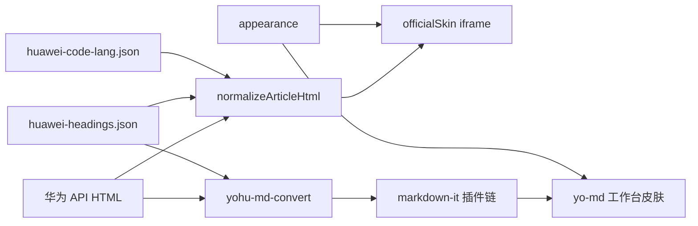

# 正文渲染：网页表面与 Markdown 表面

> 依据 YoAgentDocs architecture-design + 2026-09-09 frontend 深研。  
> **as-built（2026-09-11）：** 公共 HTML 内核 `engine/html/`，着色内核 `engine/syntax/`（语言表 + hljs 角色 → `--yo-syntax-*`），华为方言 `engine/huawei/`（可依赖 html + syntax），GitHub 仓库 `engine/github/`（独立 GFM，可依赖 markdown 目录 + syntax）。`engine/reading` 按 sourceId 与 `blobKind` 组合。html / markdown / huawei 互不 import github。syntax 不 import 任何方言。  
> 层名：Windows 桌面 `View → store → IPC → domain`。

调研原文在知识库 `research/by-stack/frontend/`（源码在 `%TEMP%\YoAgentResearch\`，不进本仓）。

## 一句话

网页阅读对齐**华为开发者文档的文章表面**（实测 CSS + HTML 规范化）；Markdown 阅读是**工作台自己的排版系统**（token + 块插件）。两条管道共享标题层级表、外观 appearance、大纲契约，**不共享文章 CSS、不高亮引擎、不提示块皮肤**。

## 设计前（问题链路）

```
同一篇华为文档有两种阅读：
  网页：iframe srcdoc ← normalizeArticleHtml + officialSkin
  Markdown：article.yo-md ← markdown-it(html:true) + DOMPurify
  「源码」是 Markdown 的 reveal，不是第三种阅读模式

标题：
  testdata/huawei-headings.json 已被网页 normalize 与 yohu-md-convert 共用
  Markdown 渲染再用默认 ATX，层级已经正确；但 .yo-md 把 h1/h2 画成 GitHub 下划线标题
  网页 h1 在铬里画一次，.y-content h1 { display:none }

正文：
  网页：16/24 行高，来自 Chrome 实测
  Markdown：14.5px / 1.7，塞在 @yohu/ui theme.css，和控件 token 混在一起

提示：
  网页：PNG 标签 → data-note + ::before「说明/注意/警告」
  转换：> [!NOTE] / [!TIP] / [!WARNING]
  Markdown：markdown-it 默认当成普通 blockquote，转换语义丢掉

代码：
  网页：y-code 浅底 + 语言/codehub 条；API HTML 无 hljs span，token 无色
  Markdown：无 highlight 插件（v2 曾写 highlight.js，未落地）
  若把 Shiki 暗色主题打进 iframe，会偏离官网浅色文档块

图片：
  网页：max-width:100%，无阴影（对）
  Markdown：max-width:100% + 圆角 + box-shadow（把插图做成卡片）
  转换产出 ，无 alt

公式：
  黄金样本与当前 HTML 中未见 TeX / MathML
  两条表面都没有公式槽位

表格：
  网页：.tablenoborder 圆角+细边
  Markdown：简易全边框，无横向滚动包裹

安全：
  ADR-W2 写「非 iframe + DOMPurify」；as-built 网页已是 iframe srcdoc
  Markdown html:true 依赖事后消毒，html_block 原样进 sanitizer
```

## 设计后（通路）

```
用户打开文档
  → store.fetchDoc
  → IPC doc.fetch / doc.html / convert
  → session.rawHtml + session.markdownText

网页表面（文档会话内始终挂着 iframe；readingSurface 只切 yohu-recipe-crossfade 的 data-active）：
  View 把 appearance + rawHtml + meta 交给宿主
  1. normalizeArticleHtml     标题标记 / note / 代码块一次解析 / 去空锚
  2. 公式门控：正文含 TeX 分隔符或 <math> 才注入对应运行时
  3. officialSkin             实测文章 token；颜色只在 [data-theme]
  4. 文章铬                   面包屑 + h1 + 更新时间 + 设备
  → iframe srcdoc（不烘焙 appearance）
  → paintWebAppearance 涂已挂载文档（换肤不重载）
  大纲：正文 heading id（normalize 写入），点右侧 yo-toc 滚 iframe 内 [data-yo-read=article]

Markdown 表面（readingSurface=markdown, reveal=rendered）：
  View 把 markdownText 交给 renderMarkdownToSafeHtml
  1. markdown-it（html:false，GFM 表/围栏）
  2. GitHub Alert 插件        > [!NOTE|TIP|WARNING] → yo-md-callout
  3. 公式插件                 $ / $$ → katex.renderToString（无公式则规则空转）
  4. highlight                engine/syntax（语言表单源；色板仍由 .yo-md 绑定 YoUI）
  5. 标题 id                  与 extractTocFromMarkdown 同一套 toc-heading-N
  6. DOMPurify 兜底
  → article.yo-md（preview 模块皮肤，引用 YoUI token，不写在 theme.css）
  大纲：markdownToc，滚 [data-yo-read=md]

Markdown 源码（reveal=source）：
  只读 textarea，不走块渲染

不经过本篇的：专栏树、频道栏、大纲 DOM、窗口标题栏。
```



## 两套表面（硬边界）

| | 网页 `y-article` | Markdown `yo-md` |
|--|------------------|------------------|
| 宿主 | iframe srcdoc | 工作台滚动容器 |
| 解析 | HTML→HTML 规范化 | markdown-it token→HTML |
| 皮肤 | `officialSkin` 实测值 | preview 模块排版 + YoUI token |
| 代码着色 | 官网 `--hl-*` 绑定 `--yo-syntax-*` | 工作台 YoUI 绑定同一套角色 |
| 提示 | 说明/注意/警告/提示 | NOTE/TIP/WARNING 的工作台 callout |
| 公式 | 门控 auto-render 或 MathML | 门控 `renderToString` |
| 标题尺 | 36/24/20/16、无下划线 | 独立阶（见下），无 GitHub 底边 |
| TOC | 禁止出现在 iframe | 禁止出现在 article 内 |

禁止：`.yo-md` 与 `.y-content` 互相 import；禁止 Infima / `.vp-doc` / `.md-typeset` 进华为或通用表面。`github-markdown-css` 只挂 GitHub 的 `.markdown-body`，不进 `.yo-md` / `.y-content`。

## 自底而上：块规范

### 0. 共享契约（不是共享皮肤）

- 标题层级：`testdata/huawei-headings.json` 继续锁 `engine/huawei` 的 `resolveHeadingLevel` 与 `yohu-md-huawei::heading_level`（契约孪生，禁止第三份）。
- 网页代码身份：`testdata/huawei-code-lang.json` 锁 `identifyWebCode`。只读 `<pre>` 的 `codehub` / `class`，不读正文。不与 Markdown 解析器共享模块。
- 大纲：网页用正文 id；Markdown 用 `toc-heading-N`。点击钉住高亮直到用户自滚（现行 readingScroll）。
- 外观：`html[data-theme]` / iframe `data-theme` 已有；块颜色只读 token 或 officialSkin 变量。
- 转换语义：`yohu-md-convert` 继续输出 ATX 标题、` ```lang `、`> [!NOTE]`、``、GFM 表。渲染器适配这份方言，不改黄金样本除非样本本身错。

### 1. 文本（段落 / 行内 / 链接 / 列表）

**网页。** 保持实测：正文 16px / 24px 行高、段上边距 24px、链接 `#0a59f7`（深色主题用 officialSkin 已有 `--link`）。列表左垫 1.4em。不要把工作台 `--yo-font-base: 13px` 灌进 iframe。正文 `<a>` 点击进 `store.openContentHref`，与主页/专栏同一条 `fetchDoc`；iframe 不 `allow-popups`，代码托管链接不 `target=_blank`。

**Markdown。** 独立阅读尺，对齐工作台而不是官网：

- 正文字号用 `--yo-font-md`（14px）或略升到 15px，行高 1.7–1.75。
- 段落间距用 token 间距，不要 0.8em 魔法数与网页 24px 混用。
- 链接用 `--yo-accent-text`，悬停才下划线。
- 行内强调 `strong` 用字重，不改色。
- 行内代码：等宽 + `--yo-code-inline-bg`，**颜色跟正文**，不要现行的强调色字（现行 `.yo-md code { color: var(--yo-accent-text) }` 去掉）。
- 最大宽继续 `--yo-canvas-max-w: 45rem`（只约束 MD 画布；网页 iframe 仍通栏，跟官网文章列）。

### 2. 标题

**网页。** 文章铬 `h1.y-title` 36/48；正文 h2 24/32 margin-top 48；h3 20/24；h4 16/24。去掉 `[hN]` 标记。与页标题相同的正文 h1 删除（现行）。不要 hash-link `#`（大纲已在右侧）。

**Markdown。** 文首 `# 标题` 仍渲染为 h1，但画布已有 `DocumentPath`，h1 视觉降为「文内封面」：字重 700、无底边、与路径条间距收紧。h2/h3/h4 用阶梯字号（约 1.35 / 1.2 / 1.05 em），**禁止** GitHub 式 `border-bottom`。id 与 TOC 同一函数生成。

### 3. 图片

**网页。** `img { max-width:100%; height:auto; display:block; margin:16px auto }`。不加圆角卡片阴影。`originwidth` 等属性可忽略。GIF 与 PNG 同等对待。

**Markdown。** 同样是流内图片：`max-width:100%; height:auto`。去掉 `border-radius`+`box-shadow`。空 alt 保持空（转换未给文件名）。本地库导出走 `image_map`；在线预览仍可能是签名 CDN URL，过期是 source 层问题，不在皮肤里用占位卡掩盖。

### 4. 公式

当前样本没有公式。槽位先定，**无分隔符则不打包运行时**。

**网页。** 扫描规范化后的正文：有 `<math>` 则只保证 MathML 可显示（不引入 KaTeX）；有 `$$` / `\[` / `\(` 才在 iframe 内 `renderMathInElement`，`ignoredTags` 含 `pre,code`，`throwOnError: false`，`trust: false`。字体自托管，与 MD 共用。

**Markdown。** markdown-it 公式插件：行内 `$`、块级 `$$` → `katex.renderToString`。不要对整篇 DOM 再 auto-render（避免代码块误伤）。macros 对象 **按篇** 创建。

两边 CSS/fonts 同一份；**何时执行** 不同。

### 5. 代码块与行内代码

**网页。** `<pre>` 先收成 `WebCodeBlock`（`testdata/huawei-code-lang.json`），再序列化 `.y-code`。身份只读页面字段：`codehub` 扩展名优先（`.ets` → ArkTS），否则 class 里的语言 token；`prettyprint` / `linenums` / `hljs` 不是语言。`class="TypeScript"` 在有 `.ets` 文件时不是身份。不根据代码正文猜 ArkTS。输出丢掉官网 class，正文是 `.y-code__body`。无 token span 时按 `grammar` 浅色着色。没有复制按钮槽，底边 12px。浅色 `--code-stroke` + `--code-shadow`；深色只留细描边、无阴影。

**Markdown。** 围栏走 `engine/syntax`（highlight.js 核心 + 显式语言表）。语言表不够时降级为纯转义。方言不互相 import 高亮文件；色板各绑各的 token。围栏铬：语言名即可。

**源码 reveal。** 保持等宽 textarea，不高亮（那是源，不是阅读块）。

### 6. 提示 / 警告

**网页。** 继续 `note note--*` + `data-note` + `::before` 中文标签；藏 PNG 与 `.notetitle`。种类：note/caution/danger/tip。左 3px 强调条 + 浅底。提示块内的标题不进 TOC。

**Markdown。** 必须把 `> [!NOTE]` / `[!TIP]` / `[!WARNING]` 收成 `div.yo-md-callout`（或等价 class），而不是 blockquote。皮肤用工作台 token（`--yo-ok-*` / `--yo-danger-*` / accent），**不要**复用 `.note` 的官网蓝。标签可用「说明 / 提示 / 注意」，但色板跟网页那套分开，避免两表面看起来像同一份 CSS 复制。

转换层 `protect.rs` 的 NOTE/TIP/WARNING 映射保持；渲染器补齐语义。

### 7. 表格

**网页。** 保留 `.tablenoborder` / 圆角 16px / 表头 `--th-bg`。宽表外包 overflow-x（Yari `table-container` 思路），不要 Infima `table { display:block }`。

**Markdown。** GFM 表：细边框、表头 `--yo-bg-subtle`、单元格用 token 间距。外包横向滚动。不要斑马纹（那是 Infima/MDN 的选择，不是我们必须抄的）。

### 8. 文章铬（非块，但会误当成块）

- 面包屑、更新时间、设备胶囊：网页在 iframe 内（官网文章头的一部分）；Markdown 用工作台 `DocumentPath`，转换产物里的「更新时间 / 来源」仍作为文首元信息段落渲染，不在操作栏再贴一份。
- 频道栏、专栏、大纲：工作台会话铬，两表面都看不到第二份。

## 模块与依赖方向

```
@yohu/ui          L0 token（字号/色/间距）。不持有 .yo-md 文章规则。
@yohu/module-preview
  engine/html/    通用 unwrap / 标题打 id / tables / math / 中性皮肤
  engine/syntax/  语言表 + 着色 + 角色 CSS（不持有任何表面色板）
  engine/huawei/  标题提升 / notes / codehub / IconPic / 官网皮肤
  engine/github/  GFM / blobKind / Prettylights 绑定
  engine/reading  按 sourceId 选引擎
  engine/markdown/  markdown-it 插件链 + KaTeX 字符串 + yo-md.css
store             持 rawHtml / markdownText / renderedHtml / toc；不写块样式
yohu-md-convert   公共 HTML→MD 内核。不渲染。
yohu-md-huawei    华为 HTML→MD 方言。不渲染。
```

下层不引用 View。KaTeX 字体作为预览模块静态资源，iframe 与工作台共用 URL，不进 `@yohu/ui`。

`theme.css` 里现有 `.yo-md { … }` 在落地时**搬到** preview 模块，避免控件库承担文档排版。

## 与旧代码的关系

| 现状 | 目标 |
|------|------|
| `officialSkin.ts` 单文件实测 CSS | 保留为网页唯一皮肤；补表滚动、浅色 token 高亮钩子 |
| `normalizeArticleHtml.ts` | 保留；公式/高亮是后续步骤，不塞进标题正则 |
| `toc.ts` 里 markdown-it `html:true` | 换成 `html:false` + Alert/公式/高亮插件；测试锁 TOC id |
| `.yo-md` 在 `theme.css` | 迁到 preview；去掉 h1/h2 底边、行内代码强调色、图片阴影 |
| v2「markdown-it + highlight.js」 | 落地为 `engine/syntax` 单源着色；网页 / MD / GitHub 只绑定各自 token，禁止方言互相 import |
| ADR-W2「非 iframe」 | 网页 as-built 已是 iframe；本篇不退回 innerHTML 混在壳里 |

替换以上文件职责，**不**加「兼容旧皮肤」开关。

## 不引入

- Infima、`.vp-doc`、`.md-typeset`、MDX（`github-markdown-css` 仅 GitHub `.markdown-body`）
- MathJax 全家桶、KaTeX `trust: true`、进程级 macros
- 全量 `import 'shiki'` / Twoslash / Monaco
- 网页 iframe 内第二份 TOC / 频道栏 / 专栏
- 把 `> [!NOTE]` 先改写成 `:::` 再解析（多一道方言）
- 为公式未出现的样本预载 katex.js
- 第三条阅读模式（网页 / 渲染 / 源码并列）
- 兼容层：一边 `html:true` 一边插件

## 验收（落地时，非本轮）

- 网页：Chrome 对比技能仍以文章表面为准（标题标记、note、浅色 pre、表、图片无卡片影）。
- Markdown：黄金样本里的 `> [!NOTE]` 必须看成 callout，不能是灰引用条。
- 切网页↔Markdown，大纲仍能滚到对应块；id 策略不允许串表面。
- `data-theme` 切换时：网页走 officialSkin 深色变量；MD 走 YoUI token + `.yo-md` highlight 色。
- 无公式文档的网络面板不应出现 katex 字体请求。
